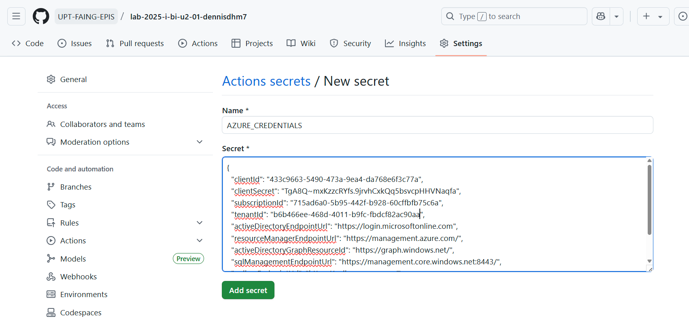

[](https://classroom.github.com/a/VYnjZKn-)
[](https://classroom.github.com/open-in-codespaces?assignment_repo_id=19687084)
# SESION DE LABORATORIO N° 01: Diseño Mutidimensional

### Nombre: Christian Dennis Hinojosa Mucho

## OBJETIVOS
  * Realizar el diseño multidimensional de escenarios de negocios con base de datos .

## REQUERIMIENTOS
  * Conocimientos: 
    - Conocimientos básicos de cualquier IDE.
    - Conocimientos básicos de Mermaid.
  * Hardware:
    - Virtualization activada en el BIOS.
    - CPU SLAT-capable feature.
    - Al menos 4GB de RAM.
  * Software:
    - Docker Desktop 
    - Tableu Desktop 20 o superior
## CONSIDERACIONES INICIALES
  * Clonar el repositorio mediante git para tener los recursos necesarios.
  * Colocar su nombre en el archivo

    
## DESARROLLO

### Ejercicio 01: Envios

El siguiente diagrama E/R simplificado describe el envío de mercancías. Los lotes pertenecientes a ciertos grupos se 
envían a ciertos destinos en varios países a través de diferentes modos de transporte. Un cierto centro de costos es 
responsable de cada envío. La dimensión de tiempo consiste en mes y año.


Supongamos que los costos de los atributos ya incluyen todas las tarifas. No se transferirá más información sobre las tarifas
al almacén de datos. El análisis tendrá lugar a nivel del grupo de centros de costos, no se necesita información sobre los 
centros de costos. 
Por favor identifique el hecho de interés y construya el Modelo Dimensional y su respectivo diagrama físico


### Ejercicio N° 02: Reservas de viaje 

En este esquema de E / R, un cliente (que es de cierto tipo) reserva un viaje en una agencia de viajes. La agencia de viajes 
trabaja para un determinado operador turístico. El viaje va a un destino determinado que pertenece a un país determinado. 
La dimensión de tiempo consiste en mes, trimestre y año.


Por favor identifique el hecho de interés y construya el Modelo Dimensional y su respectivo esquema físico


### Ejercicio N° 03: Gestión de proyectos 

Este esquema E / R simplificado muestra un caso gestión del proyecto. 
El proyecto para un cliente se divide en varios paquetes de trabajo y siempre una persona es responsable de completar la 
tarea. Se cuida en un lugar determinado. 
La dimensión de tiempo consiste de día, mes y año


Por favor identifique el hecho de interés y construya el Modelo Dimensional. Incluya un atributo de hecho adicional que 
cuente la cantidad de paquetes de trabajo. Asimismo, realice el diagrama físico

    
## ACTIVIDAD ENCARGADA

1. Generar todos los modelos fisicos de los diagramas entidad relación y modelo dimensional en bases de datos separadas en archivos lenguaje SQL (modelo01.sql, modelo02.sql y modelo03.sql).

- Ejercicio 01

  * Hecho de interés: 

     El hecho principal es el **envío**, representando cada operación logística registrada. Se analizan las medidas `cantidad_lotes` y `costo_envio`, relacionadas con las dimensiones tiempo, lote, destino, centro de costo y modo de transporte.


  * Modelo dimensional

    

  * Modelo físico

    ```SQL
    -- ============================================================
    -- Modelo Estrella (Ejercicio 01 – Envíos)
    -- ============================================================

    -- 1 CREAR LA BASE DE DATOS
    CREATE DATABASE envio_dw;GO

    -- Usar la base recién creada
    USE envio_dw;
    GO

    -- 2 TABLA DIMENSIÓN TIEMPO
    CREATE TABLE tiempo (
    id_tiempo_pk INT PRIMARY KEY,
    dia INT NOT NULL,
    mes INT NOT NULL,
    anio INT NOT NULL
    );
    GO

    -- 3 TABLA DIMENSIÓN LOTE
    CREATE TABLE lote (
    id_lote_pk INT PRIMARY KEY,
    peso DECIMAL(10,2) NOT NULL,
    grupo_lote VARCHAR(100) NOT NULL,
    tarifa_exportacion DECIMAL(10,2) NOT NULL,
    tarifa_importacion DECIMAL(10,2) NOT NULL,
    pais_origen VARCHAR(100) NOT NULL
    );
    GO

    -- 4 TABLA DIMENSIÓN DESTINO
    CREATE TABLE destino (
    id_destino_pk INT PRIMARY KEY,
    nombre_destino VARCHAR(100) NOT NULL,
    pais_destino VARCHAR(100) NOT NULL
    );
    GO

    -- 5 TABLA DIMENSIÓN CENTRO_COSTO
    CREATE TABLE centro_costo (
    id_centro_costo_pk INT PRIMARY KEY,
    responsable VARCHAR(100) NOT NULL,
    grupo_centro VARCHAR(100) NOT NULL
    );
    GO

    -- 6 TABLA DIMENSIÓN MODO_TRANSPORTE
    CREATE TABLE modo_transporte (
    id_transporte_pk INT PRIMARY KEY,
    tipo_transporte VARCHAR(100) NOT NULL
    );
    GO

    -- 7 TABLA DE HECHOS ENVIO
    CREATE TABLE envio (
    id_envio_pk INT PRIMARY KEY,
    id_tiempo_fk INT NOT NULL,
    id_lote_fk INT NOT NULL,
    id_destino_fk INT NOT NULL,
    id_centro_costo_fk INT NOT NULL,
    id_transporte_fk INT NOT NULL,
    cantidad_lotes INT NOT NULL,
    costo_envio DECIMAL(12,2) NOT NULL,
    FOREIGN KEY (id_tiempo_fk) REFERENCES tiempo(id_tiempo_pk),
    FOREIGN KEY (id_lote_fk) REFERENCES lote(id_lote_pk),
    FOREIGN KEY (id_destino_fk) REFERENCES destino(id_destino_pk),
    FOREIGN KEY (id_centro_costo_fk) REFERENCES centro_costo(id_centro_costo_pk),
    FOREIGN KEY (id_transporte_fk) REFERENCES modo_transporte(id_transporte_pk)
    );
    GO

    ```

    

- Ejercicio 02
  * Hecho de interés

      El hecho principal es la reserva de viaje, que representa cada operación en la que un cliente concreta un viaje a través de la agencia.

  * Modelo dimensional

    

  * Modelo físico
  
    ```SQL
    -- ============================================================
    -- Ejercicio 02 – Reservas de viaje
    -- ============================================================

    -- 1) CREAR LA BASE DE DATOS
    CREATE DATABASE reserva_dw;
    GO

    -- Usar la base recién creada
    USE reserva_dw;
    GO

    -- 2) TABLA DIMENSIÓN TIPO_CLIENTE
    CREATE TABLE tipo_cliente (
        id_tipo_cliente INT PRIMARY KEY,
        descripcion      VARCHAR(100) NOT NULL
    );
    GO

    -- 3) TABLA DIMENSIÓN CLIENTE
    CREATE TABLE cliente (
        id_cliente           INT PRIMARY KEY,
        nombre_cliente       VARCHAR(100) NOT NULL,
        id_tipo_cliente_fk   INT NOT NULL,
        FOREIGN KEY (id_tipo_cliente_fk)
            REFERENCES tipo_cliente(id_tipo_cliente)
    );
    GO

    -- 4) TABLA DIMENSIÓN UBICACION
    CREATE TABLE ubicacion (
        id_ubicacion    INT PRIMARY KEY,
        ciudad          VARCHAR(100) NOT NULL,
        pais_ubicacion  VARCHAR(100) NOT NULL
    );
    GO

    -- 5) TABLA DIMENSIÓN OPERADOR
    CREATE TABLE operador (
        id_operador     INT PRIMARY KEY,
        nombre_operador VARCHAR(100) NOT NULL
    );
    GO

    -- 6) TABLA DIMENSIÓN PAIS
    CREATE TABLE pais (
        id_pais      INT PRIMARY KEY,
        nombre_pais  VARCHAR(100) NOT NULL
    );
    GO

    -- 7) TABLA DIMENSIÓN DESTINO
    CREATE TABLE destino (
        id_destino    INT PRIMARY KEY,
        nombre_destino VARCHAR(100) NOT NULL,
        id_pais_fk     INT NOT NULL,
        FOREIGN KEY (id_pais_fk)
            REFERENCES pais(id_pais)
    );
    GO

    -- 8) TABLA DIMENSIÓN AGENCIA
    -- (Ahora solo tiene FK a UBICACION, sin FK a OPERADOR)
    CREATE TABLE agencia (
        id_agencia       INT PRIMARY KEY,
        nombre_agencia   VARCHAR(100) NOT NULL,
        id_ubicacion_fk  INT NOT NULL,
        FOREIGN KEY (id_ubicacion_fk)
            REFERENCES ubicacion(id_ubicacion)
    );
    GO

    -- 9) TABLA DIMENSIÓN TIEMPO
    CREATE TABLE tiempo (
        id_tiempo   INT PRIMARY KEY,
        mes         INT NOT NULL,
        trimestre   INT NOT NULL,
        anio        INT NOT NULL
    );
    GO

    -- 10) TABLA DE HECHOS RESERVA
    CREATE TABLE reserva (
        id_reserva        INT PRIMARY KEY,
        id_tiempo_fk      INT NOT NULL,
        id_cliente_fk     INT NOT NULL,
        id_agencia_fk     INT NOT NULL,
        id_operador_fk    INT NOT NULL,
        id_destino_fk     INT NOT NULL,
        FOREIGN KEY (id_tiempo_fk)
            REFERENCES tiempo(id_tiempo),
        FOREIGN KEY (id_cliente_fk)
            REFERENCES cliente(id_cliente),
        FOREIGN KEY (id_agencia_fk)
            REFERENCES agencia(id_agencia),
        FOREIGN KEY (id_operador_fk)
            REFERENCES operador(id_operador),
        FOREIGN KEY (id_destino_fk)
            REFERENCES destino(id_destino)
    );
    GO

    ```

    

- Ejercicio 03


  * Hecho de interés

    El hecho principal es la tarea o asignación de paquete de trabajo, es decir, cada vez que un paquete de trabajo es ejecutado por una persona en un lugar determinado y en un momento dado.

  * Modelo dimensional

    * 

  * Modelo físico
  
    ```SQL
    -- ============================================================
    -- Ejercicio 03 – Gestión de proyectos
    -- ============================================================

    -- 1) CREAR LA BASE DE DATOS
    CREATE DATABASE gestion_proyectos_dw;
    GO

    -- Usar la base recién creada
    USE gestion_proyectos_dw;
    GO

    -- 2) TABLA DIMENSIÓN TIEMPO
    CREATE TABLE tiempo (
    id_tiempo INT PRIMARY KEY,
    dia INT NOT NULL,
    mes INT NOT NULL,
    anio INT NOT NULL
    );
    GO

    -- 3) TABLA DIMENSIÓN PAIS
    CREATE TABLE pais (
    id_pais INT PRIMARY KEY,
    nombre_pais VARCHAR(100) NOT NULL
    );
    GO

    -- 4) TABLA DIMENSIÓN LOCALIDAD
    CREATE TABLE localidad (
    id_localidad INT PRIMARY KEY,
    nombre_localidad VARCHAR(100) NOT NULL,
    id_pais_fk INT NOT NULL,
    FOREIGN KEY (id_pais_fk) REFERENCES pais(id_pais)
    );
    GO

    -- 5) TABLA DIMENSIÓN CLIENTE
    CREATE TABLE cliente (
    id_cliente INT PRIMARY KEY,
    nombre_cliente VARCHAR(100) NOT NULL,
    telefono_cliente VARCHAR(50) NOT NULL,
    email_cliente VARCHAR(100) NOT NULL
    );
    GO

    -- 6) TABLA DIMENSIÓN PROYECTO
    CREATE TABLE proyecto (
    id_proyecto INT PRIMARY KEY,
    nombre_proyecto VARCHAR(100) NOT NULL
    );
    GO

    -- 7) TABLA DIMENSIÓN RESPONSABLE
    CREATE TABLE responsable (
    id_responsable INT PRIMARY KEY,
    nombre_responsable VARCHAR(100) NOT NULL,
    cargo_responsable VARCHAR(100) NOT NULL
    );
    GO

    -- 8) TABLA DIMENSIÓN EMPRESA
    CREATE TABLE empresa (
    id_empresa INT PRIMARY KEY,
    nombre_empresa VARCHAR(100) NOT NULL,
    rubro_empresa VARCHAR(100) NOT NULL
    );
    GO

    -- 9) TABLA DE HECHOS PAQUETE_TRABAJO
    CREATE TABLE paquete_trabajo (
    id_paquete INT PRIMARY KEY,
    id_tiempo_fk INT NOT NULL,
    id_proyecto_fk INT NOT NULL,
    id_cliente_fk INT NOT NULL,
    id_localidad_fk INT NOT NULL,
    id_responsable_fk INT NOT NULL,
    id_empresa_fk INT NOT NULL,
    cantidad_paquetes INT NOT NULL,
    costo_total DECIMAL(12,2) NOT NULL,
    FOREIGN KEY (id_tiempo_fk) REFERENCES tiempo(id_tiempo),
    FOREIGN KEY (id_proyecto_fk) REFERENCES proyecto(id_proyecto),
    FOREIGN KEY (id_cliente_fk) REFERENCES cliente(id_cliente),
    FOREIGN KEY (id_localidad_fk) REFERENCES localidad(id_localidad),
    FOREIGN KEY (id_responsable_fk) REFERENCES responsable(id_responsable),
    FOREIGN KEY (id_empresa_fk) REFERENCES empresa(id_empresa)
    );
    GO

    ```

    

2. Contruir la base de datos en Azure utilizando Terraform crear el archivo infra/main.tf.
  * Creamos la carpeta infra y el archivo main.tf para poner la configuración principal de Terraform, donde declararemos toda la infraestructura que se creara de forma descriptiva y automatizada.
  
    main.tf
    ```
    # azure
    # Grupo de recursos
    resource "azurerm_resource_group" "rg_lab2025" {
      name     = "rg-lab2025"
      location = var.location
    }

    # Servidor MSSQL
    resource "azurerm_mssql_server" "sqlsrv_lab2025" {
      name                         = "lab2025sqlsrv"
      resource_group_name          = azurerm_resource_group.rg_lab2025.name
      location                     = azurerm_resource_group.rg_lab2025.location
      version                      = "12.0"
      administrator_login          = var.sql_admin_user
      administrator_login_password = var.sql_admin_password
    }

    # Base de datos: Envio DW
    resource "azurerm_mssql_database" "db_envio_dw" {
      name         = "envio_dw"
      server_id    = azurerm_mssql_server.sqlsrv_lab2025.id
      collation    = "SQL_Latin1_General_CP1_CI_AS"
      license_type = "LicenseIncluded"
      sku_name     = "S0"
    }

    # Base de datos: Reserva DW
    resource "azurerm_mssql_database" "db_reserva_dw" {
      name         = "reserva_dw"
      server_id    = azurerm_mssql_server.sqlsrv_lab2025.id
      collation    = "SQL_Latin1_General_CP1_CI_AS"
      license_type = "LicenseIncluded"
      sku_name     = "S0"
    }

    # Base de datos: Gestión de Proyectos DW
    resource "azurerm_mssql_database" "db_gestion_proyectos_dw" {
      name         = "gestion_proyectos_dw"
      server_id    = azurerm_mssql_server.sqlsrv_lab2025.id
      collation    = "SQL_Latin1_General_CP1_CI_AS"
      license_type = "LicenseIncluded"
      sku_name     = "S0"
    }
    ```
    outputs.tf
    ```
    output "resource_group_name" {
      value = azurerm_resource_group.rg_lab2025.name
    }

    output "sql_server_name" {
      value = azurerm_mssql_server.sqlsrv_lab2025.name
    }

    output "envio_dw_name" {
      value = azurerm_mssql_database.db_envio_dw.name
    }

    output "reserva_dw_name" {
      value = azurerm_mssql_database.db_reserva_dw.name
    }

    output "gestion_proyectos_dw_name" {
      value = azurerm_mssql_database.db_gestion_proyectos_dw.name
    }
    ```
    providers.tf
    ```
    terraform {
      required_providers {
        azurerm = {
          source  = "hashicorp/azurerm"
          version = "~> 3.0"
        }
      }
      required_version = ">= 1.2.0"
    }

    provider "azurerm" {
      features {}
    }

    ```
    variables.tf
    ```
    variable "location" {
      type        = string
      default     = "West US 2"
      description = "Región donde se desplegarán los recursos"
    }

    variable "sql_admin_user" {
      type        = string
      default     = "adminuser"
      description = "Usuario administrador del servidor SQL"
    }

    variable "sql_admin_password" {
      type        = string
      default     = "Upt.2025"
      sensitive   = true
      description = "Contraseña del administrador SQL"
    }
    ```
  * Nos logeamos con azure "az login"
    
  * Ejecutamos "terraform init"
    
  * Ejecutamos "terraform terraform plan -out main.tfplan"
    
  * Ejecutamos "terraform apply main.tfplan"
    
    
  * Verificamos nuestros recursos y las bases de datos creadas en el Portal de Azure
    
    

3. Contruir la automatización (.github/worflows/deployInfra.yml) para que se despliegue la infraestructura creado en el paso previo, teniendo en cuenta los laboratorios anteriores.

  * Configuramos GitHub - Actions
    
  * Creamos el archivo .github/worflows/deployInfra.yml
    ```
    name: Deploy Infraestructura Azure

    on:
      push:
        paths:
          - 'infra/**'
        branches:
          - main

    jobs:
      deploy:
        runs-on: ubuntu-latest

        steps:
          - name: Checkout repositorio
            uses: actions/checkout@v3

          - name: Iniciar sesión en Azure
            uses: azure/login@v1
            with:
              creds: ${{ secrets.AZURE_CREDENTIALS }}

          - name: Instalar Terraform
            uses: hashicorp/setup-terraform@v2
            with:
              terraform_version: 1.5.7

          - name: Inicializar Terraform
            run: terraform -chdir=infra init

          - name: Planificar infraestructura
            run: terraform -chdir=infra plan -out main.tfplan

          - name: Aplicar infraestructura
            run: terraform -chdir=infra apply -auto-approve main.tfplan
      ```
  * Verificamos que se haya desplegado en github y tambien verificamos nuestra cuenta de azure.
      
      


4. Contruir la automatización (.github/worflows/deployDatabase.yml) para que se desplieguen los modelos creados en la actividad 1 utilizar el action https://github.com/liquibase-github-actions/update.

  * Creamos nuestro archivo deployDatabase.yml
    ```
    name: Deploy Modelos SQL con Liquibase

    on:
      push:
        paths:
          - 'modelo*.sql'
        branches:
          - main

    jobs:
      deploy-modelos:
        runs-on: ubuntu-latest

        steps:
          - name: Checkout código
            uses: actions/checkout@v3

          - name: Ejecutar modelo01.sql → envio_dw
            uses: liquibase-github-actions/update@v4.32.0
            with:
              changelogFile: modelo01.sql
              url: jdbc:sqlserver://lab2025sqlsrv.database.windows.net:1433;database=envio_dw
              username: ${{ secrets.SQL_USER }}
              password: ${{ secrets.SQL_PASS }}
              driver: com.microsoft.sqlserver.jdbc.SQLServerDriver

          - name: Ejecutar modelo02.sql → reserva_dw
            uses: liquibase-github-actions/update@v4.32.0
            with:
              changelogFile: modelo02.sql
              url: jdbc:sqlserver://lab2025sqlsrv.database.windows.net:1433;database=reserva_dw
              username: ${{ secrets.SQL_USER }}
              password: ${{ secrets.SQL_PASS }}
              driver: com.microsoft.sqlserver.jdbc.SQLServerDriver

          - name: Ejecutar modelo03.sql → gestion_proyectos_dw
            uses: liquibase-github-actions/update@v4.32.0
            with:
              changelogFile: modelo03.sql
              url: jdbc:sqlserver://lab2025sqlsrv.database.windows.net:1433;database=gestion_proyectos_dw
              username: ${{ secrets.SQL_USER }}
              password: ${{ secrets.SQL_PASS }}
              driver: com.microsoft.sqlserver.jdbc.SQLServerDriver


    ```
  * Hacemos unos cambios en los archivos modelox.sql, solo vas en modificar algo, en este caso agrega un comentario
    
  * Agregamos los secretos de SQL_USER y SQL_PASS
    
  * Agregamos una regla de firewall en el servidor sqlserver que tenemos en azure
    
  * Realizamos el commit y push para realizar la Prueba despliegue de deployDatabase.yml
  * Verificamos que se haya ejecutado en github
    
